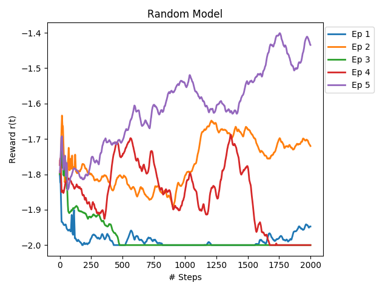

shepherd_gym
============

[](https://travis-ci.org/buntyke/shepherd_gym)
[](https://codecov.io/github/buntyke/shepherd_gym?branch=master)

Gym environment implementation of dog shepherding task

Simulations
-----------

Heuristic model simulation (generated using matplotlib):


Rewards for heuristic model (rewards keep increasing):


Rewards for random model (rewards remain low):



Usage
-----

This package has several scripts:

* To run a simulation of the heuristic model:
  ```
  $ python examples/shepherd_sim.py
  ```

* To test the dog heuristic model with the shepherd gym env:
  ```
  $ python examples/shepherd_heuristic.py
  ```

  The program supports several command line arguments. Check using:
  ```
  $ python examples/shepherd_heuristic.py -h
  ```

Installation
------------

* The library can be installed by running:
  ```
  $ pip install -e .
  ```

Requirements
------------
* gym>=0.10.8 
* numpy>=1.15.0
* matplotlib>=2.2.2

Compatibility
-------------

* python>=3.5 

Authors
-------

`shepherd_gym` was written by `Nishanth Koganti <buntyke@gmail.com>`.
